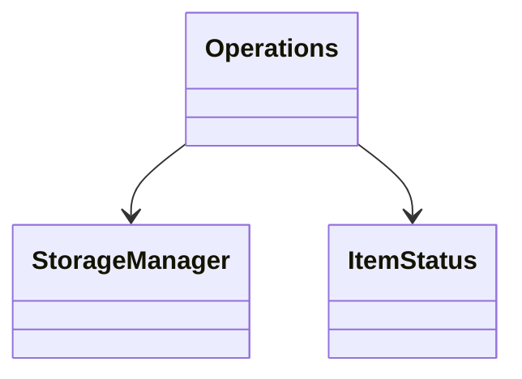
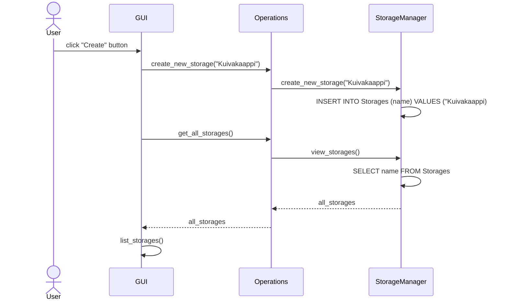

# Arkkitehtuurikuvaus

## Rakenne

Ohjelman rakenne on kolmitasoinen: käyttöliittymä, logiikasta vastaava Operations-luokka ja tietokantojen käsittelystä vastaava StorageManager-luokka.
Ohjelman tässä kehitysvaiheessa graafinen käyttöliittymä on alkeellinen ja suunnitellusta toiminnallisuudesta saa paremman kuvan tekstikäyttöliittymän avulla. 

## Sovelluslogiikka

Ohjelma käsittelee SQLite tietokantaa, johon tallennetaan tieto olemassa olevista varastoista ja niiden täyttötilanteista. StorageManager-luokka käsittelee tietokantaoperaatioita. Operations-luokan metodien avulla dataa voidaan käsitellä ja välittää tieto käyttöliittymälle. Operations-luokka käyttää ItemStatus-luokkaa tarkastaakseen varaston tavaroiden täyttöasteen ja ajantasaisuuden.

  
## Tietojen pysyväistallennus

Repositories-pakkauksen StorageManager käsittelee SQLite-tietokantaa. Tietokannassa on kaksi taulua: Storages ja Items. Storages-tauluun tallennetaan olemassa olevien varastojen nimet ja kokonaistäyttöaste. Items-taulu referoidaan Storages-tauluun ja siihen tallennetaan varastoitavat tavarat ja yksittäisten tavaroiden täyttöasteet. 

Taulut alustetaan init_db.py-tiedostossa.

## Päätoiminnallisuudet

### Uuden varaston luominen

Käyttäjä syöttää Create new storage-näkymän syötekenttään uuden varaston nimen ja valitsee "Create"-painikkeen.

Tapahtumankäsittelijä kutsuu Operations-luokkaa, joka puolestaan välittää kutsun StorageManager-luokalle. StorageManager tallentaa Storages-tauluun uuden varaston nimen. Tämän jälkeen tapahtumankäsittelijä palauttaa päänäkymän joka kutsuu Operations-luokan kautta StorageManageria. StorageManager palauttaa listan kaikkien varastojen nimistä, jonka jälkeen päänäkymän list_storages-metodi listaa varastot ja tarjoaa painikkeen, jota painamalla käyttäjä pääsee käsittelemään varastoja.
