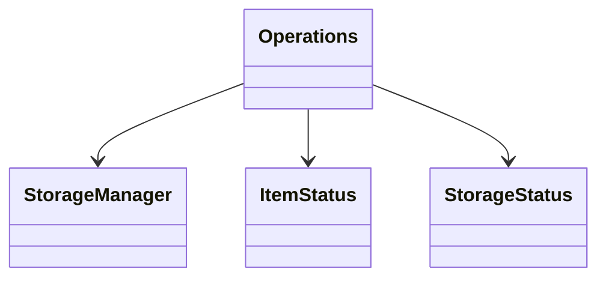
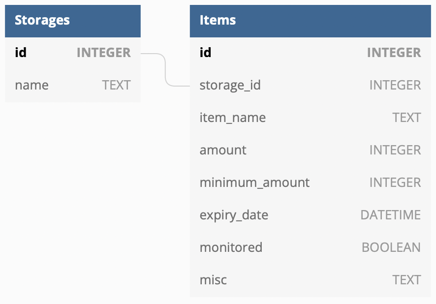
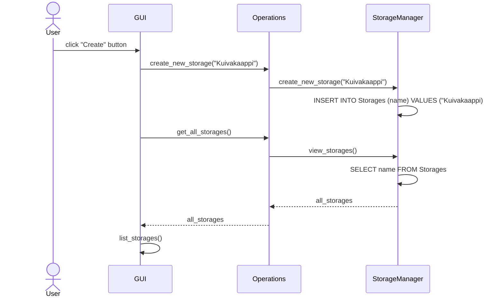
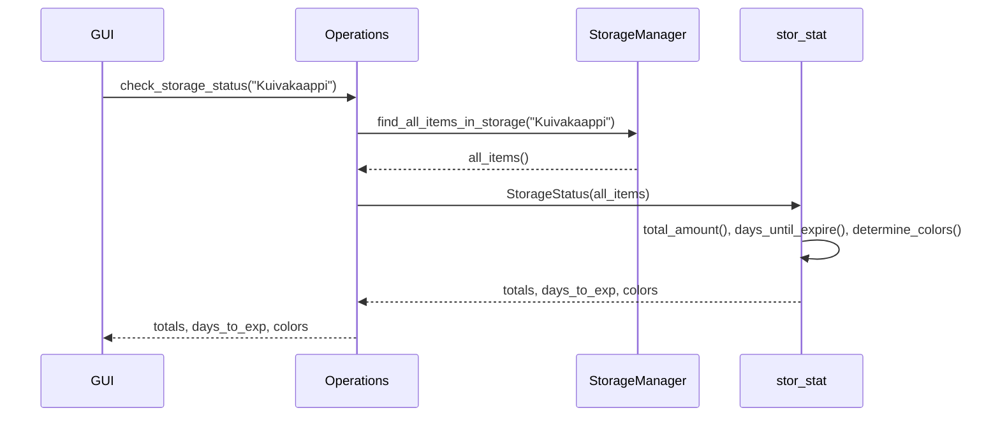
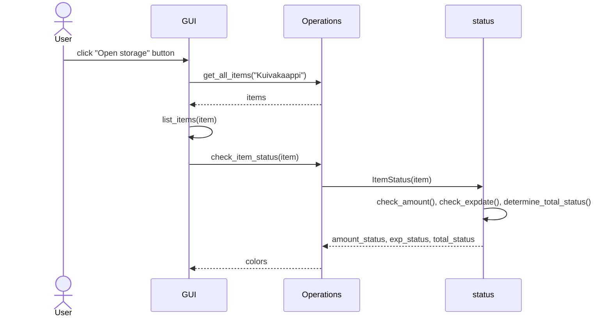

# Arkkitehtuurikuvaus

## Rakenne

Ohjelman rakenne on kolmitasoinen: käyttöliittymä, logiikasta vastaava Operations-luokka ja tietokantojen käsittelystä vastaava StorageManager-luokka. Lisäksi Operations-luokka käyttää status_app.py-tiedoston luokkia varastojen tilan tarkkailussa.

## Sovelluslogiikka

Ohjelma käsittelee SQLite tietokantaa, johon tallennetaan tieto olemassa olevista varastoista ja niiden täyttötilanteista. StorageManager-luokka käsittelee tietokantaoperaatioita. Operations-luokan metodien avulla dataa voidaan käsitellä ja välittää tieto käyttöliittymälle. Operations-luokka käyttää ItemStatus-luokkaa tarkastaakseen varaston tavaroiden täyttöasteen ja ajantasaisuuden ja StorageStatus-luokkaa varaston tilanteen tarkasteluun. 

  
## Tietojen pysyväistallennus

Repositories-pakkauksen StorageManager käsittelee SQLite-tietokantaa. Tietokannassa on kaksi taulua: Storages ja Items. Storages-tauluun tallennetaan olemassa olevien varastojen nimet ja kokonaistäyttöaste. Items-taulu referoidaan Storages-tauluun ja siihen tallennetaan varastoitavat tavarat ja yksittäisten tavaroiden täyttöasteet. 

Taulut alustetaan init_db.py-tiedostossa.

## Päätoiminnallisuudet

### Uuden varaston luominen ja päänäkymän logiikka

Käyttäjä syöttää Create new storage-näkymän syötekenttään uuden varaston nimen ja valitsee "Create"-painikkeen.

Tapahtumankäsittelijä kutsuu Operations-luokkaa, joka puolestaan välittää kutsun StorageManager-luokalle. StorageManager tallentaa Storages-tauluun uuden varaston nimen. Tämän jälkeen tapahtumankäsittelijä palauttaa päänäkymän joka kutsuu Operations-luokan kautta StorageManageria. StorageManager palauttaa listan kaikkien varastojen nimistä. Seuraavaksi päänäkymän list_storages-metodi käy läpi listan varastot ja kutsuu kunkin varaston kohdalla Operations-luokan check_storage_status-metodia, joka puolestaan kutsuu StorageStatus-luokkaa joka palauttaa varaston täyttötilanteen.

list_storages-metodi luo päänäkymään listan josta selviää kunkin varaston nimi, täyttöaste muodossa xx/xx, päivien lukumäärä ennen ensimmäiseksi vastaan tulevaa vanhenemispäivää ja painikkeen jonka kautta käyttäjä voi avata varaston tarkempaa tarkastelua ja muokkausta varten. Varaston tiedot on värikoodattu StorageStatus-luokan avulla.

### Varasto-näkymän logiikka

Kun käyttäjä valitsee päänäkymästä varaston riviltä "Open storage" painikkeen, aukeaa varastonäkymä. Varastonäkymä hakee listan kaikista varaston tavaroista ja käsittelee listan tavarat list_items-metodissa.

list_items-metodi generoi listan varaston tavaroista värikoodattuna. Listan rivi koostuu varaston nimestä, täyttöasteesta, vanhenemispäivämäärästä, tiedosta onko tavara tarkastelun alainen, lisätietokentästä sekä painikkeesta, jonka avulla käyttäjä pääsee muokkaamaan tuotteen parametrejä.