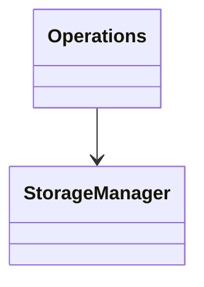

# Arkkitehtturikuvaus

## Rakenne

Ohjelman rakenne on kolmitasoinen: käyttöliittymä, logiikasta vastaava Operations-luokka ja tietokantojen käsittelystä vastaava StorageManager-luoka.
Ohjelman tässä kehitysvaiheessa graafinen käyttöliittymä on keskeneräinen ja toiminnaillisuudesta saa paremman kuvan tekstikäyttöliittymän avulla.

## Sovelluslogiikka

Ohjelma käsittelee SQLite tietokantaa, johon tallennetaan tieto olemassa olevista varastoista ja niiden täyttötilanteista. StorageManager-luokka käsittelee tietokantaoperaatioita. Operations-luokan metodien avulla dataa voidaan käsitellä ja välittää tieto käyttöliittymälle.

  
## Tietojen pysyväistallennus

Repositories-pakkauksen StorageManager käsittelee SQLite-tietokantaa. Tietokannassa on kaksi taulua: Storages ja Items. Storages-tauluun tallennetaan olemassa olevien varastojen nimet ja kokonaistäyttöaste. Items-taulu referoidaan Storages-tauluun ja siihen tallennetaan varastoitavat tavarat ja yksittäisten tavaroiden täyttöasteet. 

Taulut alustetaan init_db.py-tiedostossa.

