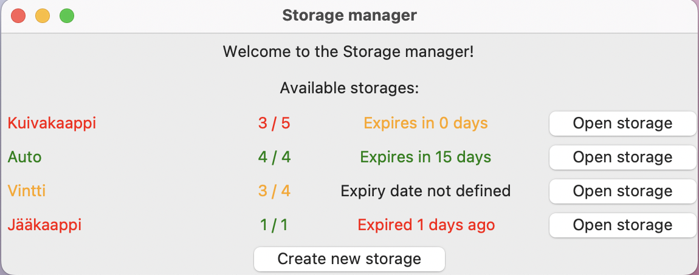
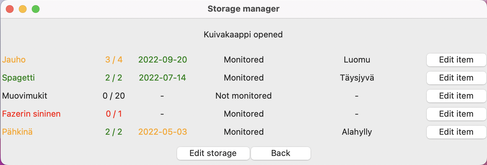
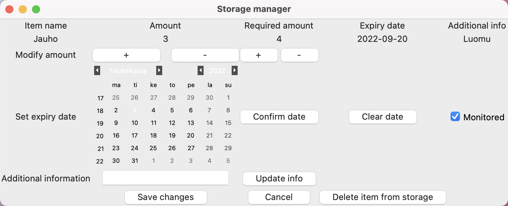

# Käyttöohje

## Sovelluksen lataus

Lataa sovelluksen uusin [release](https://github.com/aleksiskela/ot-harjoitustyo/releases/tag/Loppupalautus) ja pura zip-tiedosto.

## Ohjelman käynnistäminen

Siirry ohjelman hakemistoon. Seuraavat komennot tulee suorittaa juurihakemistosta käsin.

Asenna vaadittavat riippuvuudet komennolla *poetry install*

Alusta tallennustiedosto komennolla *poetry run invoke initiate*

Käynnistä sovellus komennolla *poetry run invoke start*

## Konfigurointi

Ohjelman käyttämä tietokanta tallennetaan juuressa sijaitsevaan data-kansioon. Tietokanta-tiedoston oletusnimi on data.db. Tiedoston nimeä voi muokata juurihakemistossa sijaitsevassa .env-tiedostossa muokkaamalla muuttujan DATABASE_FILENAME arvoa.

Tallennustiedoston nimenmuutoksen jälkeen tulee uusi tallennustiedosto vielä luoda komennolla *poetry run invoke initiate* ennen ohjelman seuraavaa käynnistämistä.

## Päänäkymä

Sovellus käynnistyy päänäkymään:

Päänäkymässä käyttäjä näkee kaikki luodut varastot ja niiden yleiskuvan. Värikoodaus auttaa hahmottamaan varaston täyttöasteen ja ajantasaisuuden nopeasti.

Värien merkitykset:
- Vihreä: varasto on täynnä ja vanhenemispäivään on yli kolme päivää
- Keltainen: varaston täyttöaste on 75-99 % ja/tai varaston ensimmäisenä vanheneva tavara vanhenee kolmen päivän sisällä
- Punainen: varaston täyttöaste on alle 75 % ja/tai jokin varaston tavara on vanhentunut
- Musta: millekään tavaralla ei ole määritelty vanhenemispäivämäärää

Päänäkymästä voidaan siirtyä uuden varaston luontiin painikkeella "Create new storage" tai avata varasto painikkeella "Open storage".

## Varastonäkymä

Päänäkymästä voidaan siirtyä varastonäkymään:

Varastonäkymästä käyttäjä näkee valitun varaston sisällön. Tavaran nimen vieressä näkyy määrä, vaadittava minimimäärä, vanhenemispäivämäärä, tarkastelustatus, lisätietokenttä sekä muokkauspainike. Värikoodaus mukailee päänäkymän logiikkaa. Jos tarkastelustatus (ohjelmassa "monitored") on valittu pois päältä, ei tavara ole tarkastelun alla, eikä näin ollen vaikuta värien muodostukseen.

Varastonäkymästä voidaan siirtyä varaston minimivarustelun muokkausta tai varaston poistamista varten painikkeella "Edit storage" tai muokkaamaan tiettyä tavaraa valitsemalla tavaraalistalta painike "Edit item". 

## Tavaran muokkausnäkymä

Tavaran parametrejä voidaan muokata tavaranäkymässä:

Tavaran voimassa olevat tiedot näkyvät ylärivillä, sekä oikeassa reunassa olevassa Monitored-valinnassa. Käyttäjä voi muokata tavaran lukumäärää, minimimäärää, vanhenemispäivää ja lisätietokenttää. Päivämäärän muuttamisen jälkeen tulee tieto päivittää yläriville "Confirm date" tai "Clear date" painikkeella ja lisätietokentän muutos "Update additional info" painikkeella. Valitsemalla oikeasta reunasta Monitored-laatikko aktiiviseksi, saadaan tuote värikooditarkastelun alaiseksi. Muussa tapauksessa tavaran täyttöastetta ja vanhenemispäivää ei tarkastella. 
