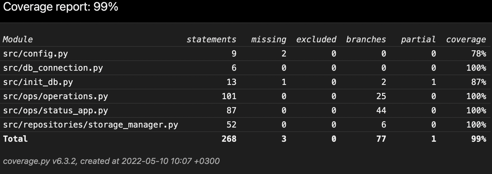

# Testausdokumentti

Ohjelmaa on testattu automaattisesti unittestillä yksikkö- ja integraatiotestein. Käyttöliittymän testaus on suoritettu manuaaliseti.

## Automaattiset ksikkö- ja integraatiotestit

### Sovelluslogiikka ja tietokanta

TestOperations-luokka testaa Operations-luokkaa. Useassa testissä ulotutaan tietokantaoperaatioista vastaavan StorageManager-luokan toiminnallisuuteen sekä tilatarkasteluista vastaaviin status_app.py-tiedoston StorageStatus- ja ItemStatus-luokkiin. TestStorageManager-luokka keskittyy yksityiskohtaisemmin StorageManagerin testeihin ja status_app.py:n luokille on myös omat testiluokkansa. 

Testejä varten on .env.test-tiedostoon määritelty erillinen tietokantatiedosto testejä varten.

### Testauskattavuus

Ohjelman testien haaraumakattavuus on 99 %

## Manuaalinen järjestelmätestaus

### Asennus

Sovelluksen asennus on testattu käyttöohjeen mukaisesti Linux- ja macOS ympäristöissä. Konfiguraatio-tiedoston muokkausta on myös testattu.

### Toiminnallisuudet

Kaikki määrittelydokumentin toiminnot on testattu manuaalisesti graafista käyttöliittymää käyttäen. Testeissä on pyritty kattamaan myös mahdolliset virhesyötteet.

